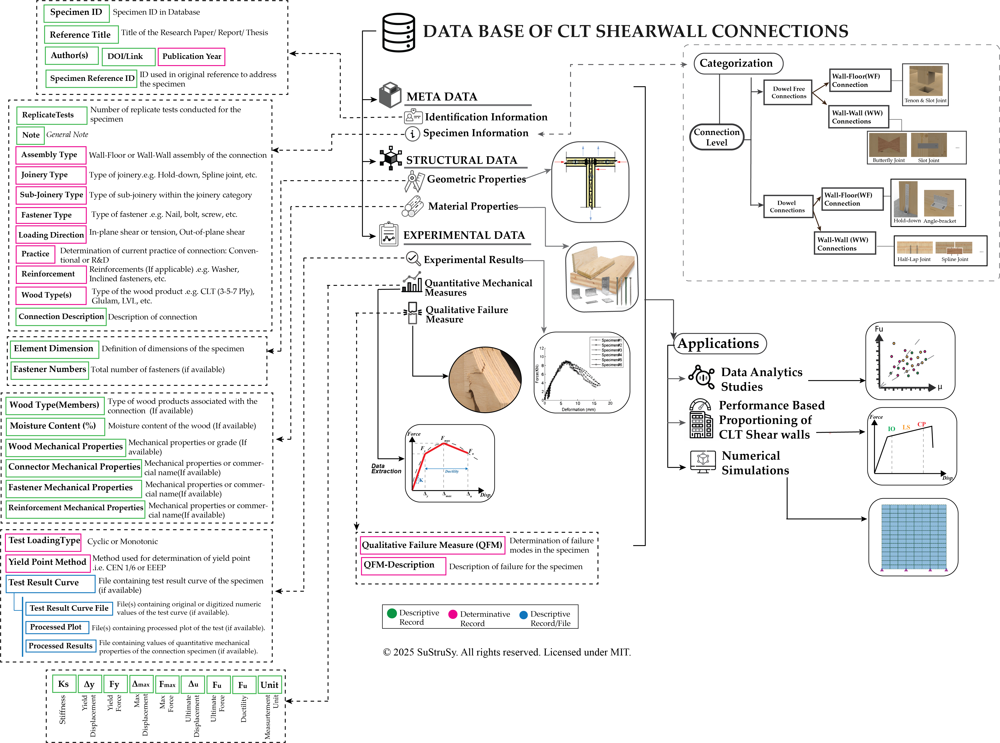

# CLT Shearwall Connections Database

A comprehensive database of cross-laminated timber (CLT) shearwall connections presenting qualitative and quantitative mechanical performance collected from experimental campaigns. This database is designed to support research, design, and performance-based evaluation in mass timber construction.
**Latest update:** 27 Aug 2025
---

## Overview

The database compiles data from **522 connection sets** (2048 associated test specimens) spanning conventional (commercial) and R&D (experimental/innovative) joinery types used worldwide. It enables systematic assessment of connection performance under **in-plane tensile and shear loading**, supporting:

- Experimental development of new connection types  
- Numerical simulations and parametric studies  
- Performance-based design of multi-panel CLT shearwalls  

The database is **expandable and adaptable**, providing a framework for analytics-driven design and future research.

---

## Database Structure

The database consists of three main sections:

- **Metadata** – Identification and specimen information, including assembly type, joinery type, fastener type, loading direction, and source.  
- **Structural Data** – Geometric details, material properties, and connection configuration.  
- **Experimental Data** – Quantitative and qualitative performance metrics, including load-deformation curves, failure modes, and associated input files.  

Connections are categorized into **Dowel-free** and **Dowel** types, and assemblies are classified as **Wall-Floor (WF)** or **Wall-Wall (WW)**. Determinative records enable systematic comparisons, while descriptive records provide supporting experimental and graphical information.

---

## Key Features

- **Extensive Data Collection:** Aggregated data from experimental studies worldwide.  
- **Performance Assessment:** Qualitative and quantitative metrics for tensile and shear loading.  
- **Timber Connections:** Includes commercial joinery and innovative R&D connections.  
- **Expandable Framework:** Users can expand the database horizontally (more records) and vertically (additional parameters).

---

## Example Use

- Comparative analysis of connection performance  
- Numerical modeling and simulations  
- Design scenario exploration for multi-panel CLT shearwalls  

## Disclaimer

The data aggregated in this database has been collected manually from the references cited. Use of the data is **at the discretion of the user**, and caution is advised. For design and implementation purposes, users should always refer to **manufacturer specifications** or **case-specific experimental test results**.

The database is provided **“as is”**. The authors and contributors assume **no responsibility or liability** for any errors, omissions, or misuse of the data, nor for any outcomes arising directly or indirectly from its application.

---

## License

**Copyright © 2025 Amirhossein Heidari. All rights reserved.**  
This project is licensed under the **MIT License** – see the LICENSE file for details.

---

## The Overall Structure of the Database

  
## 📂 Download the Database
The Access database used in this project is available in the [latest release]

👉 **[Download the database file here](https://github.com/SuStrucSy/CLT-Shearwall-Connections-Database/releases/tag/CLT-SHWC-DB-V1.0)**
